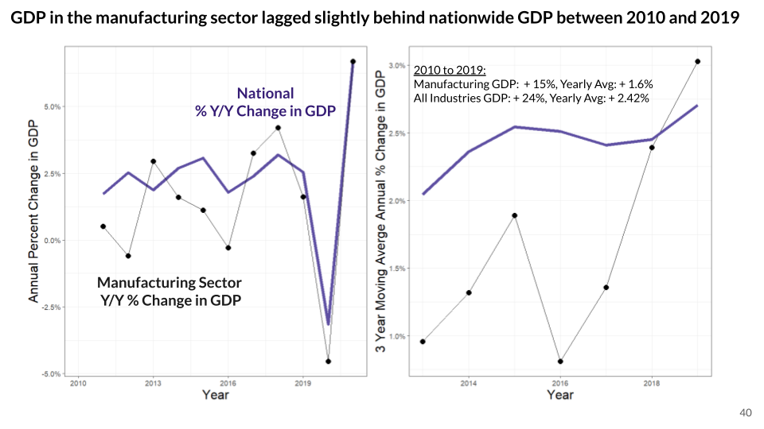
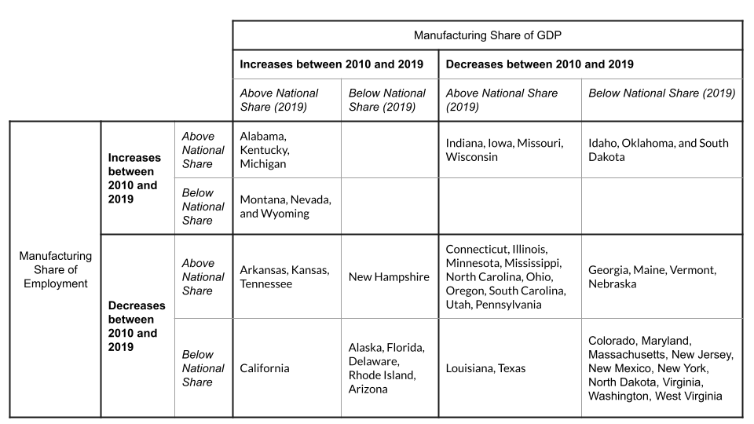

```{r setup, include=FALSE}
knitr::opts_chunk$set(echo = FALSE, warning = FALSE)
```

This is a document to provide some basic context about the US Manufacturing Economy before the pandemic, using 2019 as a baseline year and also benchmarking changes between 2010 and 2019 to capture some long time trends. This memo uses the Quarterly Census of Employment and Wages for employment data and the Bureau of Economic Analysis Regional GDP data for GDP data.

**Summary**: Nationally, the manufacturing share of the economy, measured both in terms of employment and GDP, has been declining since 2010. At the state level, we a far more heterogenous manufacturing economy: in some states, the manufacturing sector outpacing state GDP and employment growth between 2010 and 2019; in others, the manufacturing sector lags behind all-sector growth slightly. 

```{r, include = FALSE}
library(tigris)
library(tidyverse)
library(here)
library(leaflet)
library(ggrepel)
library(RColorBrewer)
library(grid)
library(gridExtra)
library(cowplot)

title_theme <- theme(axis.text = element_text(size = 14), 
        axis.title = element_text(size = 18), 
        title = element_text(size = 20))

axis_theme <- theme(axis.text = element_text(size = 10), 
        axis.title = element_text(size = 18))
```

```{r, include = FALSE}
area_codes <- readRDS(here("State Data/area_crosswalk.RDS")) %>% 
  mutate(area_title = str_remove(area_title, " -- Statewide")) %>% 
  mutate(area_fips = case_when(
    nchar(area_fips) == 4 ~ paste("0", area_fips, sep = ""), 
    TRUE ~ area_fips
  ))
```

```{r, include = FALSE}
states <- data.frame(state_abbr = state.abb, area_title = state.name)
```

```{r, include = FALSE}
area_codes <- left_join(area_codes, states)
```

```{r, include = FALSE}
manf_col <- brewer.pal(9, "Set3")[5]
total_col <- "#A5764D"
```

In this document, we seek to establish some baseline context about state manufacturing ecosystems. We focus on manufacturing employment and GDP, examining state and county level 2-digit NAICS codes (31-33), as well as state level 3-digit NAICS codes (300's).

We consider both absolute values, the share of the manufacturing economy relative to the total state economy, trends over time, and benchmark against both state and national level averages.

In addition, we break down the composition of manufacturing activity at both the state industry and geography levels.

For this work, we use data from the BLS QCEW (Quarterly Cencus of Employment and Wages), as well as the BEA's regional GDP measures. The procedure that we define can be modified to incorporate more granular data as well.


```{r}
#We start by loading in previously cleaned data and setting up some base maps.
manf_data <- readRDS(here("State Data/manf_clean.RDS"))
county_emp <- readRDS(here("State Data/county_employment.RDS"))
state_ind <- readRDS(here("State Data/state_ind.RDS"))
nat_gdp <- readRDS(here("State Data/national_gdp.RDS"))
```

```{r, include = FALSE}
# We can then easily join our existing datasets for some easy mapping. We start with our state level maps to begin with.
# STATE MAP 

states_sf <- states(cb = TRUE, resolution = "20m") %>%
shift_geometry(position = "outside")

states_leaflet <- states_sf %>% 
  sf::st_transform('+proj=longlat +datum=WGS84')
```

```{r, include = FALSE}
# COUNTY MAP 
county_sf <- counties(cb = TRUE)

county_leaflet <- county_sf %>% 
  sf::st_transform('+proj=longlat +datum=WGS84')
```


# State level maps

In general, we are looking to create a series of maps. The first map shows raw levels, the second map benchmarks these levels against national or state averages, the third map shows change between two specific years (either in percent change or raw percentage points in the case of manufacturing share), and the fourth map benchmarks this change against national or state averages.

As we work towards these maps, we will endeavor to explore data interactively to better contextualize our information. The high degree of heteregeneity across states, counties, and manufacturing industries suggests that at the moment, manufacturing ecosystems could be considered "high-dimensional" data structures. In our work, we seek to simplify the number of dimensions that we need to evaluate manufacturing ecosytems across, and create meanigful categorizations of state manufacturinge ecosystems.

```{r}
state_manf <- states_leaflet %>% 
  left_join(manf_data %>% rename(NAME = area_title))
```

We begin with 2019 as our year of reference.

```{r}
state_manf_2019 <- state_manf %>% 
  filter(year == 2019, !is.na(NAME))
```

## 2019 Employment Levels

```{r}
# We endeavor to build an interactive map that provides us with the information that we care about.

#To accomplish this, we have to create a color mapping function, plot a base map using leaflet (addPolygons function), and then add highlight options that contain customized, dynamic text to populate the labels with (highlightOptions). This work uses the leaflet package. 

state_manf_2019 <- state_manf_2019 %>% 
  mutate(emp_k = emp / 1000,
    emp_thousands = prettyNum(emp, big.mark = ',',scientific=FALSE))
```

```{r}
# As we go through setting up our first interactive map, we will try and define some functions to help us create new maps later. 

emp_col <- colorNumeric(palette = "BuPu", domain = state_manf_2019$emp_k, reverse = TRUE)
```

```{r}
#DEFINE COLOR FUNCTION
col_def <- function(data, var, col_scale){ 
  
  col_pal <- colorNumeric(palette = col_scale, domain = data$var, reverse = TRUE)
  
  }
```

```{r}
emp_col <- col_def(state_manf_2019, emp_k, "BuPu")
```

```{r}
#Create Labels for popups
labels <- sprintf(
  "<strong>%s</strong><br/>%s <br/> <i>Avg Monthly Employees <br/> %g, (NAICS 31-33)</i>",
  state_manf_2019$NAME, state_manf_2019$emp_thousands, state_manf_2019$year
) %>% lapply(htmltools::HTML)
```

```{r}
#Define dynamic column selector function 

var_def <- function(data, var) {
  
  var_list <- data %>% 
    tibble() %>% 
    select({{ var }}) %>% 
    unlist()
  
  names(var_list) <- NULL 
  
  return(var_list)
}
```

```{r}
#Define dynamic label Creator

label_1 <- function(data, var, text, sector){
  
  name_vec <- var_def(data, NAME) 
  
  year_vec <- var_def(data, year)
  
  val_vec <- var_def(data, {{ var }})
  
  if(typeof(year_vec) == "character"){
    
    sprintf(paste("<strong>%s</strong><br/>%s <br/> <i>", text, "<br/> %s,", sector, "</i>", sep = ""),
  name_vec, val_vec, year_vec
  
    ) %>% lapply(htmltools::HTML) }
  
  else{
  
  sprintf(paste("<strong>%s</strong><br/>%s <br/> <i>", text, "<br/> %g,", sector, "</i>", sep = ""),
  name_vec, val_vec, year_vec
  
) %>% lapply(htmltools::HTML) } 
  
}
```

```{r}
emp_labels <- label_1(state_manf_2019, emp_thousands, "Avg Monthly Employees", "(NAICS 31-33)")
```

```{r}
# Build map (Add Pologyons)
m <-  state_manf_2019 %>% 
  leaflet() %>% 
  addPolygons(
  fillColor = ~emp_col(state_manf_2019$emp_k),
  weight = 2,
  opacity = 1,
  color = "black",
  dashArray = "3",
  fillOpacity = 0.7, 
  highlightOptions = highlightOptions(
    weight = 5,
    color = "#666",
    dashArray = "",
    fillOpacity = 0.7,
    bringToFront = TRUE),
  label = emp_labels,
  labelOptions = labelOptions(
    style = list("font-weight" = "normal", padding = "3px 8px"),
    textsize = "15px",
    direction = "auto"))
  
```

```{r}
# We now  to define some more generic functions for mapping. 
build_map <- function(data, var1, label_var, colors, text, sector, legend_title) { 
  
  col_list <- var_def(data, {{ var1 }})
  
  col_fun <- col_def(data, var1, colors)
  
  popup_lablels <- label_1(data, {{ label_var }}, text, sector)
  
  m <- data %>% 
  leaflet() %>% 
  addPolygons(
  fillColor = ~col_fun(col_list),
  weight = 2,
  opacity = 1,
  color = "black",
  dashArray = "3",
  fillOpacity = 0.7, 
  highlightOptions = highlightOptions(
    weight = 5,
    color = "#666",
    dashArray = "",
    fillOpacity = 0.7,
    bringToFront = TRUE),
  label = popup_lablels,
  labelOptions = labelOptions(
    style = list("font-weight" = "normal", padding = "3px 8px"),
    textsize = "15px",
    direction = "auto")) %>% 
    addLegend(pal = col_fun, values = col_list, opacity = 0.7, title = legend_title,
  position = "bottomleft")
  
  return(m)
  }
```

**Manufacturing employment is concentrated in a few states**

```{r, echo = FALSE}
build_map(state_manf_2019, emp, emp_thousands, "BuPu", "Avg Monthly Emploment", " (NAICS 31-33)", "2019 NAICS 31-33 <br/> Monthly Employees")
```

In terms of absolute numbers, we see that manufacturing employment is dominated by the larger economies (Texas and California), but we also see that there is a substantial amount of manufacturing employment in the midwest region.

## 2019 GDP Levels

Turning to GDP, we see that manufacturing GDP is dominated by the largest states; however, the delta between the largest states and the rest of the states appears to be larger than with manufacturing employment.

```{r}
state_gdp_2019 <- state_manf_2019 %>% 
  filter(!is.na(gdp_manf)) %>% 
  mutate(gdp_manf_b = gdp_manf/10000,
    gdp_manf_b_clean = round(gdp_manf_b, 2), 
    manf_gdp_share_perc = manf_gdp_share*100, 
    manf_gdp_share_clean = paste(round(manf_gdp_share_perc, 2), "&#37", sep = ""),
    manf_emp_share_perc = manf_emp_share*100, 
    manf_emp_share_clean = paste(round(manf_emp_share_perc, 2), "&#37", sep = ""))
```

**Larger delta between largest states and the rest with Manufacturing GDP**

```{r, echo = FALSE}
gdp_manf_1 <- build_map(state_gdp_2019, gdp_manf_b, gdp_manf_b_clean, "BuPu", "Avg Annual GDP, 2012$B", " (NAICS 31-33)", "2019 NAICS 31-33 <br/> Avg Annual GDP (2012$B)")

gdp_manf_1
```

We can also plot the correlation between manufacturing employment and manufacturing gdp.

```{r, echo = FALSE}
gdp_emp_2019 <- state_manf_2019 %>% 
  ggplot() + 
  geom_point(shape = 21, aes(x = gdp_manf, y = emp, size = state_gdp), fill = brewer.pal(9, "Set3")[1], color = "black") + 
  scale_x_continuous(labels = scales::unit_format(unit = "$B", scale = 1e-4)) + 
  scale_y_continuous(labels = scales::unit_format(unit = "K", scale = 1e-3)) + 
  labs(x = "NAICS 31-33 Annual GDP in Billions of $2012", y = "NAICS 31-33 Average Monthly Employees, Thousands") + 
  guides(size = "none") + 
  theme_bw()

gdp_emp_2019 + geom_text_repel(aes(x = gdp_manf, y = emp, label = STUSPS), max.overlaps = 30) + labs(title = "Manufacturing GDP and Employment Tightly Correlated")
```

## 2019 Manufacturing Share

Because the size of state economies seems to dominate much of the across-state variance in manufacturing, we normalize by the size of each state's total economy and consider the manufacturing share of employment and GDP.

### 2019 Manufacturing Share (GDP)

**The Southwest and Midwest Regions Have the Largest Share of Manufacturing GDP**

```{r, echo = FALSE}
gdp_manf_share <- build_map(state_gdp_2019, manf_gdp_share_perc, manf_gdp_share_clean, "BuPu", "Annual &#37 of State GDP", " (NAICS 31-33)", "2019 NAICS 31-33 <br/> Annual &#37 of State GDP")

gdp_manf_share
```

The Southwest and Midwest regions have particularly high shares of manufacturing GDP.

### 2019 Manufacturing Share (Employment)

Notably, the map of the manufacturing sector share of employment appears to be similar to the map of the manufacturing share of GDP, with a few states appearing to have a higher relative manufacturing share of employment than GDP. This suggests that some states might be considered "labor-intensive" manufacturing economies, as opposed to other states that might be considered more "capital-intensive,"consistent with exisiting theory and evidence (Fuchs et al., 2020).

**A similar set of states have high shares of manufacturing employment**

```{r, echo = FALSE}
emp_manf_share <- build_map(state_gdp_2019, manf_emp_share_perc, manf_emp_share_clean, "BuPu", " &#37 of State Employment", " (NAICS 31-33)", "2019 NAICS 31-33 <br/>  &#37 of State Employment")

emp_manf_share
```

We can confirm that the share of manufacturing GDP tracks roughly with the share of manufacturing employment. We can also track how  manufacturing share of state GDP and employment benchmarks against the manufacturing share of national employment and GDP. We see that most states that are above the national average for either share of GDP or employment are also above the national average for the other measure, with a few exceptions. 

*In 2019, high-manufacturing GDP states tend to be high-manufacturing employment states, with some exceptions* 

```{r, fig.width=11,fig.height=8}
manf_share <- manf_data %>% 
  filter(year == 2019) %>% 
  ggplot() + 
  geom_point(aes(x = manf_gdp_share, y = manf_emp_share)) + 
  geom_text_repel(aes(x = manf_gdp_share, y = manf_emp_share, label = state_abbr)) + 
  geom_hline(yintercept = .1011102) + 
  geom_vline(xintercept = 0.1331193) + 
  geom_label(x = .29, y = .10, label = "Manufacturing Share \nof National Employment \n 10%") + 
  geom_label(x = .13, y = .17, label = "Manufacturing Share \nof National GDP \n 13%") +
  labs(x = "Manufacturing Share of State GDP", y = "Manufacturing Share of State Employment") + 
  scale_x_continuous(labels = scales::percent) + 
  scale_y_continuous(labels = scales::percent) + 
  theme_bw() + 
  axis_theme

manf_share
```

Here, the location of states along the four sides of the quadrant defined by the manufacturing share of national GDP and employment might provide the first possible measure of categorization. 

```{r}
emp_year_usa <- function(data, yr) { 
  data %>% 
    ungroup() %>%  filter(year == yr) %>% select(usa_manf_emp_share) %>% distinct() %>% unlist()
  }
```

```{r}
gdp_year_usa <- function(data, yr) { 
  data %>% 
    ungroup() %>%  filter(year == yr) %>% select(manf_share) %>% distinct() %>% unlist()
  }
```


```{r}
nat_emp_2019 <- manf_data %>% emp_year_usa(2019)
```

```{r}
nat_gdp_2019 <- nat_gdp %>% gdp_year_usa(2019)
```

```{r}
state_categorization_2019 <- manf_data %>% 
  filter(year == 2019) %>% 
  mutate(rel_gdp = case_when(
    manf_gdp_share > nat_gdp_2019 ~ 1, 
    manf_gdp_share <= nat_gdp_2019 ~ -1
  ), 
  rel_emp = case_when(
    manf_emp_share > nat_emp_2019 ~ 1, 
    manf_emp_share <= nat_emp_2019 ~ -1
  ), 
  state_quadrant = case_when(
    rel_gdp > 0 & rel_emp > 0  ~ "Above National Share, GDP & Employment", 
    rel_gdp < 0 & rel_emp > 0 ~ "Above National Share, Employment", 
    rel_gdp > 0 & rel_emp < 0 ~ "Above National Share, GDP", 
    rel_gdp < 0 & rel_emp < 0 ~ "Below National Share, GDP & Employment"
  ))
```

```{r}
quad_cols <- brewer.pal(8, "Accent") %>% tail(4)
```


```{r, fig.width=11,fig.height=8}
cat1_graph <- state_categorization_2019 %>% 
  filter(!is.na(state_abbr)) %>% 
  ggplot() + 
  geom_point(shape = 21, aes(x = manf_gdp_share, y = manf_emp_share, fill = state_quadrant), size = 3, color = "black", alpha = 0.7) + 
  geom_text_repel(aes(x = manf_gdp_share, y = manf_emp_share, label = state_abbr)) + 
  scale_fill_brewer(palette = "Set1") + 
  geom_hline(yintercept = nat_emp_2019) + 
  geom_vline(xintercept = nat_gdp_2019) + 
  geom_label(x = .29, y = .10, label = "Manufacturing Share \nof National Employment \n 10%") + 
  geom_label(x = .13, y = .17, label = "Manufacturing Share \nof National GDP \n 13%") +
  labs(x = "Manufacturing Share of State GDP", y = "Manufacturing Share of State Employment") + 
  scale_x_continuous(labels = scales::percent) + 
  scale_y_continuous(labels = scales::percent) + 
  theme_bw() + 
  guides(fill = "none")+ 
  axis_theme

cat1_graph
```


# 2019 Industry Composition

We now turn to our industry composition data. Here, we are interested in both understanding which industries are dominant in a state, how these top industries vary across states, and how concentrated the states economy is in a few particular industries. To accomplish this, we will focus on the top 3-5 industries in the state, as well as construct a Herfindahl Hirschman index to measure concentration.

```{r}
# Read in employment data. 
ind_emp_2019 <- readRDS(here("State Data/industry_emp.RDS"))
```

```{r}
# read cross walk
industry_titles <- read_csv(here("State Data/industry-titles.csv")) %>% 
  filter(str_length(industry_code) == 3) %>% 
  mutate(industry_code = as.numeric(industry_code))
```

```{r}
# perform some of our calculations in our state_ind dataset first, and then merge this dataset with our map. 
state_ind_2019 <- state_ind %>% 
  filter(year == 2019) %>% 
  mutate(Description = str_remove(Description, "manufacturing")) %>% 
  group_by(GeoName) %>% 
  arrange(desc(manf_ind_gdp), .by_group = TRUE) %>% 
  mutate(ind_tal = seq(n())) 
```

Focusing on only the top 3 manufacturing industries in a state, we get a list of 12 industries. Expanding this to top 4 gives us a list of 16 industries, 17 for 5, and 18 for 6.

```{r}
state_ind_2019 %>% 
  filter(ind_tal < 5) %>% 
  ungroup() %>% 
  count(Description) %>% 
  arrange(desc(n))
```

Exploring our dataset, we see that the dropoff in industry GDP between the "top" industry in a state, and the next highest industry can be quite steep (as in the case of Alaska), or more gradual (as in the case of Alabama).

```{r}
#To display our data in a map, we will remember the top line industry, and then create a variable that holds the description of the top 3 along with their industry GDPs. 

ind_comp <- state_ind_2019 %>% 
  group_by(GeoName) %>% 
  mutate(ind_hhi = sum(ind_share_state**2, na.rm = TRUE)) %>% 
  mutate(gdp_pretty = prettyNum(manf_ind_gdp, big.mark = ',',scientific=FALSE),
    desc_3 = paste(
    Description, ": ", gdp_pretty, "<br/>", 
    lead(Description), ": ", lead(gdp_pretty), "<br/>", 
    lead(Description, 2), ": ", lead(gdp_pretty, 2), sep = ""
  ))
```

```{r, echo = FALSE, fig.width=11,fig.height=8}
ind_comp_fig <- ind_comp %>% 
  filter(ind_tal <=3) %>% 
  rename(area_title = GeoName) %>% 
  left_join(states) %>% 
  filter(!is.na(state_abbr)) %>% 
  left_join(state_categorization_2019 %>% select(state_abbr, state_quadrant, gdp_manf)) %>% 
  ggplot() + 
  geom_col(aes(x = manf_ind_gdp/gdp_manf, reorder(state_abbr, state_gdp), group = state_abbr, fill = Description), position = "stack", color = "black", alpha = 0.8) + 
  scale_fill_brewer(palette = "Paired") + 
  labs(x = "Sub-Industry Share of Manufacturing Economy (GDP)", y = "", fill = "", title = "Some States More Concentrated than Others") + 
  theme_bw() + 
  axis_theme + 
  theme(legend.position = "bottom")

ind_comp_fig 
```


```{r, eval = FALSE}
ind_comp_fig + 
  facet_wrap(~state_quadrant) 
```

It doesn't appear as though there are obvious, consistent patterns in the top manufacturing sub-sectors across our previously established quadrants of state manufacturing. 

```{r}
state_ind_2019_clean <- ind_comp %>% 
  filter(ind_tal == 1) %>% 
  rename(NAME = GeoName)
```

```{r}
state_ind_2019_map <- left_join(states_leaflet, state_ind_2019_clean) %>% 
  filter(!is.na(ind_hhi))
```

```{r}
#Define Colors. Because of differences in what we are trying to display, we will need to use new color and label defining functions to display our map. 

ind_colors <- colorFactor(palette = brewer.pal(12, "Paired"), domain = state_ind_2019_map$Description)
```

```{r}
#Define Labels

ind_labels <- sprintf(
  "<strong>%s</strong> <br/>  HHI: %g <br/> Millions of &#36 2012, Manufacturing Subsector <br/> <i> %s </i>",
  state_ind_2019_map$NAME, state_ind_2019_map$ind_hhi, state_ind_2019_map$desc_3) %>% lapply(htmltools::HTML)
```

**Consistent Pattern in Largest Manufacturing Industries by GDP**

We see that there are some consistent patterns in the "dominant" industries across states, and that some of these patterns appear to be geographic as well (such as the chemical corridor in the Midwest extending East, and the Southwestern food and Beverage corridor)

```{r, echo = FALSE}
#Having defined our color scale and labels, we can map our industry data. 
state_inds <- state_ind_2019_map %>% 
  leaflet() %>% 
  addPolygons(
  fillColor = ~ind_colors(state_ind_2019_map$Description),
  weight = 2,
  opacity = 1,
  color = "black",
  dashArray = "3",
  fillOpacity = 0.7, 
  highlightOptions = highlightOptions(
    weight = 5,
    color = "#666",
    dashArray = "",
    fillOpacity = 1,
    bringToFront = TRUE),
  label = ind_labels,
  labelOptions = labelOptions(
    style = list("font-weight" = "normal", padding = "3px 8px"),
    textsize = "15px",
    direction = "auto")) %>% 
  addLegend(pal = ind_colors, values = state_ind_2019_map$Description, opacity = 0.7, title = "Highest State 3-Digit <br/>Manufacturing Subsector Annual GDP",
  position = "bottomleft")

state_inds
```

## Employment

We now look at industry employment by state.

```{r}
state_ind_2019_emp <- ind_emp_2019 %>% 
  left_join(industry_titles) %>% 
  left_join(manf_data %>% 
              filter(year == 2019) %>% 
              select(area_title, manf_emp = emp, tot_emp)) %>% 
  group_by(area_title) %>% 
  arrange(desc(emp), .by_group = TRUE) %>% 
  mutate(ind_tal_emp = seq(n())) %>% 
  mutate(emp_share = emp/tot_emp,
         pretty_emp = prettyNum(emp, big.mark = ',',scientific=FALSE), 
    ind_hhi_emp = sum(emp_share**2, na.rm = TRUE), 
    Description = str_remove(industry_title, "NAICS"),
    Description = str_remove(Description, "manufacturing"),
    desc_3 = paste(
    Description, ": ", pretty_emp, "<br/>", 
    lead(Description), ": ", lead(pretty_emp), "<br/>", 
    lead(Description, 2), ": ", lead(pretty_emp, 2), sep = ""
  )) 
```

```{r}
state_ind_2019_emp %>% 
  filter(ind_tal_emp < 4) %>% 
  ungroup() %>% 
  count(industry_title) %>% 
  mutate(industry_title = str_sub(industry_title, 10)) %>% 
  arrange(desc(n))
```

```{r}
ind_emp_cols <- c(brewer.pal(11, "Paired"), brewer.pal(3, "Dark2"))
```

```{r}
state_ind_emp_2019_map <- left_join(states_leaflet, state_ind_2019_emp %>% 
                                   rename(NAME = area_title) %>% 
                                     filter(ind_tal_emp == 1))%>% 
  filter(!is.na(desc_3))
```

```{r}
#As above, we prepare a color scheme and popup for our map.
ind_colors_emp <- colorFactor(palette = ind_emp_cols, domain = state_ind_emp_2019_map$Description)
```

```{r}
#Define Labels
ind_labels_emp <- sprintf(
  "<strong>%s</strong> <br/>  HHI: %g <br/> Millions of &#36 2012, Manufacturing Subsector <br/> <i> %s </i>",
  state_ind_emp_2019_map$NAME, state_ind_emp_2019_map$ind_hhi_emp, state_ind_emp_2019_map$desc_3) %>% lapply(htmltools::HTML)
```

We see that the most dominant manufacturing sub-industry by employment is different than the most dominant sub-industry by GDP, again reflecting that certain manufacturing industries are labor intensive, and some are capital intensive.

**Dominant Manufacturing Sub-Industries by Employment Different than by GDP**

```{r, echo = FALSE}
state_inds_emp <- state_ind_emp_2019_map %>% 
  leaflet() %>% 
  addPolygons(
  fillColor = ~ind_colors_emp(state_ind_emp_2019_map$Description),
  weight = 2,
  opacity = 1,
  color = "black",
  dashArray = "3",
  fillOpacity = 0.7, 
  highlightOptions = highlightOptions(
    weight = 5,
    color = "#666",
    dashArray = "",
    fillOpacity = 1,
    bringToFront = TRUE),
  label = ind_labels_emp,
  labelOptions = labelOptions(
    style = list("font-weight" = "normal", padding = "3px 8px"),
    textsize = "15px",
    direction = "auto")) 

state_inds_emp %>% 
  addLegend(pal = ind_colors_emp, values = state_ind_emp_2019_map$Description, opacity = 0.7, title = "Highest State 3-Digit NAICS 31-33 <br/>Average Monthly Employees",
  position = "bottomleft")
```

```{r, fig.width=11,fig.height=8}
ind_comp_emp <- state_ind_2019_emp %>% 
  filter(ind_tal_emp < 4) %>% 
  filter(!is.na(state_abbr)) %>% 
  rename(ind_emp = emp) %>% 
  left_join(state_categorization_2019 %>%  select(state_abbr, emp, state_quadrant)) %>% 
  ggplot() + 
  geom_col(aes(x = ind_emp/emp, reorder(state_abbr, tot_emp), group = state_abbr, fill = Description), position = "stack", color = "black") + 
  scale_fill_brewer(palette = "Paired") + 
  labs(x = "Industry Share of Manufacturing Economy \n(Employment)", y = "", fill = "", title = "Manufacturing employment dominated by Food, Transportation, and Computer/Electronic sub-industries") + 
  theme_bw() + 
  axis_theme + 
  theme(legend.position = "bottom") 

ind_comp_emp
```

```{r, eval = FALSE}
ind_comp_emp + 
  facet_wrap(~state_quadrant)
```

So far, we have seen evidence that states vary by their manufacturing share and size of GDP/Employment, as well as the major sub-industries that make up their manufacturing economy. It is possible that there are patterns in the dominant manufacturing sub-sectors by employment and GDP across the previous quadrants of state manufacturing share benchmarks we established earlier. However, these patterns are as yet not obvious. 

We can, however, examine how the overall concentration of manufacturing activity across its various sub-sectors correlates with our previously established state manufacturing share benchmarks. 


```{r}
ind_conc_categorization <- state_ind %>% 
  filter(year == 2019) %>% 
  rename(area_title = GeoName) %>% 
  mutate(ind_share_state_sq = ind_share_state**2) %>% 
  group_by(area_title) %>% 
  reframe(hhi_ind = sum(ind_share_state_sq, na.rm = TRUE)) %>% 
  select(area_title, hhi_ind) %>% 
  left_join(state_ind_2019_emp %>% select(state_abbr, area_title, ind_hhi_emp) %>% distinct()) %>%
  left_join(state_categorization_2019 %>% select(state_abbr, state_quadrant))
```

```{r,  fig.width=11,fig.height=8}
ind_conc_graph <- ind_conc_categorization %>% 
  filter(!is.na(state_abbr)) %>% 
  ggplot() + 
  geom_jitter(aes(x = hhi_ind, y = ind_hhi_emp, fill = state_quadrant), color = "black", shape = 21, size = 3) + 
  geom_text_repel(aes(x = hhi_ind, y = ind_hhi_emp, label = state_abbr, group = state_quadrant))  +
  scale_fill_brewer(palette = "Set1") + 
  labs(x = "Industry HHI Index (GDP)", y = "Industry HHI Index (EMPLOYMENT)", fill = "State Manufacturing Share Benchmarks", title = "Manufacturing Sub-Sector Concentration Varies with State Manufacturing Benchmarks") + 
  theme_bw() + 
  axis_theme

ind_conc_graph
```

Wee see that states with low sub-sector concentration in both GDP and employment tend to also be below the manufacturing national share of GDP and employment. States that are above the national share for GDP and employment, are respectively more concentrated along those dimensions. 

Before we explore county level data, we finish out our analysis at the state manufacturing level by examining trends in manufacturing growth over time. 

NEXT: Compare with case of manf growth > state growth 


# 2019 County Data

We now examine the geographic distribution of manufacturing in each state to understand how manufacturing activity is distributed across the state. Here, ideally, we will want to know the distribution of manufacturing activity at the sub-industry level across counties. We can use the NETS data to obtain this information.

Note: For now, to establish our proof of concept we will use county employment data to measure the geographical composition of manufacturing across the US. In the future, we will want to change this to GDP data.

```{r}
county_emp_2019 <- county_emp %>% 
  filter(year == 2019) %>% 
  mutate(COUNTYFP = substr(area_fips, start = 3, stop = str_length(area_fips))) %>% 
  rename(STATEFP = st) %>% 
  filter(disclosure_code != "N")
```

```{r}
county_emp_map_2019 <- left_join(
  county_leaflet %>% 
    mutate(STATEFP = as.numeric(STATEFP)), county_emp_2019
)

#With our mapping dataset constructed, we start by displaying manufacturing employment levels for each county. As before, we want to construct our color palette and label for the map. Fortunately we can use our previous function for colors. 
```

```{r}
county_cols <- col_def(county_emp_map_2019, emp, brewer.pal(9, "Spectral"))
```

```{r}
county_labels <- sprintf(
  "<strong>%s</strong> <br/> %s <br/> %s <br/> 2019 Average Monthly Employees <br/> <i> NAICS 31-33 </i>",
  county_emp_map_2019$STATE_NAME, county_emp_map_2019$NAME, county_emp_map_2019$emp) %>% lapply(htmltools::HTML)
```

We see that manufacturing employment is concentrated in a few specific counties, with most counties having around 50,000 estimated average monthly employees. The top manufacturing counties have more than five times this number of estimated average monthly employees.

```{r}
county_emp_levels <- county_emp_map_2019 %>% 
  leaflet() %>% 
  setView(-97.59211, 37.91239, zoom = 4) %>% 
  addPolygons(
  fillColor = ~county_cols(county_emp_map_2019$emp),
  weight = 1,
  opacity = 0.5,
  color = "black",
  dashArray = "3",
  fillOpacity = 0.7, 
  highlightOptions = highlightOptions(
    weight = 5,
    color = "#666",
    dashArray = "",
    fillOpacity = 0.7,
    bringToFront = TRUE),
  label = county_labels,
  labelOptions = labelOptions(
    style = list("font-weight" = "normal", padding = "3px 8px"),
    textsize = "15px",
    direction = "auto")) %>% 
  addLegend(pal = county_cols, values = county_emp_map_2019$emp, opacity = 0.7, title = "2019 NAICS 31-33 <br/> Average Monthly Employees",
  position = "bottomleft")

county_emp_levels
```

To account for the impact of population and normalize results across counties, we investigate the county's share of state employment. While most of the counties that dominated in terms of raw manufacturing employment also have large shares of manufacturing employment, we are able to identify new counties across regions (Northwest, Mountain West, Midwest, Southeast and Northeast) that have a higher than average manufacturing share of employment.

```{r}
county_2019_share <- county_emp_map_2019 %>% 
  left_join(manf_data %>% filter(year == 2019) %>% select(tot_emp, area_title)) %>% 
  mutate(emp_share = emp/tot_emp, 
         emp_share_perc = emp_share*100,
         emp_share_perc_clean = paste(round(emp_share_perc, 2), "&#37"))
```

```{r}
#Again, we define colors and labels. 
county_cols_share <- col_def(county_2019_share, emp_share, brewer.pal(9, "Spectral"))
```

```{r}
county_labels_share <- sprintf(
  "<strong>%s</strong> <br/> %s <br/> %s <br/> 2019 Share of State Employment <br/> <i> NAICS 31-33 </i>",
  county_2019_share$STATE_NAME, county_2019_share$NAME, county_2019_share$emp_share_perc_clean) %>% lapply(htmltools::HTML)
```

```{r}
county_emp_share <- county_2019_share %>% 
  leaflet() %>% 
  setView(-97.59211, 37.91239, zoom = 4) %>% 
  addPolygons(
  fillColor = ~county_cols_share(county_2019_share$emp_share),
  weight = 1,
  opacity = 0.5,
  color = "black",
  dashArray = "3",
  fillOpacity = 0.7, 
  highlightOptions = highlightOptions(
    weight = 5,
    color = "#666",
    dashArray = "",
    fillOpacity = 0.7,
    bringToFront = TRUE),
  label = county_labels_share,
  labelOptions = labelOptions(
    style = list("font-weight" = "normal", padding = "3px 8px"),
    textsize = "15px",
    direction = "auto"))  %>% 
  addLegend(pal = county_cols_share, values = county_2019_share$emp_share, opacity = 0.7, title = "2019 NAICS 31-33 <br/> Share of State Employment",
  position = "bottomleft")

county_emp_share
```

```{r}
county_emp_calcs <- county_emp_2019 %>% 
  filter(!is.na(state_abbr)) %>% 
  rename(county_emp = emp) %>% 
  left_join(manf_data %>% filter(year == 2019) %>%  select(state_abbr, emp, tot_emp)) %>% 
  mutate(county_share = county_emp/emp)
```

We see that some states have manufacturing employment concentrated in fewer counties than other states do.

```{r, fig.width=11,fig.height=8}
county_emp_graph <- county_emp_calcs %>% 
  mutate(county_share = county_emp / tot_emp) %>% 
  ggplot() + 
  geom_col(aes(x = county_share, y = reorder(state_abbr, tot_emp), fill = county_share), color = "black") + 
  scale_fill_distiller(palette = "Spectral") + 
  guides(fill = "none")+ 
  labs(x = "County manufacturing (31-33) employment share of state employment", y = "") + 
  scale_x_continuous(labels = scales::percent) + 
  theme_bw() + 
  axis_theme

county_emp_graph
```

We can now compare state-wise industry concentration with state-wise geographic concentration measures. We that there might be a weak inverse correlation between state industry concentration and state geographic concentration.

```{r}
ind_comp_clean <- ind_comp %>% 
  left_join(area_codes) %>% 
  select(state_abbr, ind_hhi, state_gdp) %>% 
  filter(!is.na(state_abbr)) %>% 
  distinct()
```

```{r}
county_ind_comp <- county_emp_calcs %>% 
  mutate(county_share_sq = county_share**2) %>% 
  group_by(state_abbr) %>% 
  reframe(county_hhi = sum(county_share_sq)) %>% 
  left_join(ind_comp_clean)
```

```{r, fig.width=11,fig.height=8}
concentration_comp <- county_ind_comp %>% 
  ggplot() + 
  geom_point(aes(x = ind_hhi, y = county_hhi)) + 
  geom_text_repel((aes(x = ind_hhi, y = county_hhi, label = state_abbr)), size = 3) + 
  labs(x = "Industry HHI by State", y = "County HHI by State", title = "Apparent weak inverse correlation between county concentration and industry concentration?") + 
  theme_bw() + 
  axis_theme

concentration_comp
```

# Mix of Small and Large Establishments

We now try and establish some measures around the mix of small and large establishments in a state. 

```{r}
#import previously constructed data 
size_all_clean <- readRDS(here("State Data/qcew_size.RDS"))
```


We note that because of disclosure issues in the data, the establishment level variable is more accurate than the employment level variable. We now have a dataset where we can explore the distribution of firms of different sizes across the economy as a whole (all industries), and across the manufacturing industry (NAICS 31-33). 

First, we explore how the distribution of firm size varies between the manufacturing sector and the state economy as a whole. Because there are so many more small firms, we examine the distribution of establishments in the log scale. We see that the variance of the distribution of establishment size is higher in the manufacturing sector than in the state economy as a whole. 

```{r, fig.width=11,fig.height=8}
ind_size_all <- size_all_clean %>% 
  filter(year == 2019) %>% 
  left_join(area_codes) %>% 
  left_join(manf_data %>% select(area_fips, year, state_gdp)) %>% 
  filter(!is.na(state_abbr)) %>% 
  ggplot() + 
  geom_col(aes(x = log(estabs), y = reorder(state_abbr, state_gdp), fill = reorder(size_title, size_code)), color = "black") + 
  facet_wrap(~industry_title) + 
  scale_fill_brewer(palette = "Paired") + 
  labs(x = "Log Establishments in State, by Industry", y = "", fill = "", title = "State Patterns of Establishment Size Similar Across:\n Manufacturing, All Industries") + 
  guides(fill = guide_legend(reverse = TRUE)) + 
  theme_bw() + 
  axis_theme 

ind_size_all
```


As per Fuchs et al, 2020, the manufacturing sector differs from the rest of the economy in that the density of firms is not monotonically decreasing with firm size. However, this pattern is only broken in a few states. While we might want to test the relationship between the distribution of firm size in manufacturing compared to the rest of the state in robusteness checks, we save this task for later. 

We can create and indicator to note when a size class has a greater density of establishments than the size class smaller than it. We note that in 2019, 23 states have such instances, mostly in the band of establishments between 20 to 49 employees (AL, CT, IA, IL, IN, KS, MA, MN, MO, NC, NJ, OH, PA, RI, SC, SD, VA, WI), though 5 states (DE, IN, NH, SD, WI) have a density increase in establishments with 10 to 19 employees (over 5-9), 2 (AR, ND) with a density increase in establishments with 100-249 + employees (over 50-99 employees); 2 (DE, VT) with a density increase in establishments with over 1000 + employees (over 500 - 999). 

```{r}
size_manf_clean <- size_all_clean %>% 
  filter(industry_code == "31-33") %>% 
  left_join(area_codes) %>%
  filter(!is.na(state_abbr)) %>% 
  group_by(state_abbr, year) %>% 
  arrange(size_code, .by_group = TRUE) %>% 
  mutate(monotonic = estabs > lag(estabs), 
         all_monotonic = sum(monotonic, na.rm = TRUE))
```


```{r, fig.width=11,fig.height=8}
manf_size_all <- size_all_clean %>% 
  filter(year == 2019, industry_code == "31-33") %>% 
  left_join(area_codes) %>% 
  left_join(manf_data %>% select(area_fips, year, state_gdp)) %>% 
  filter(!is.na(state_abbr)) %>% 
  ggplot() + 
  geom_col(aes(x = log(estabs), y = reorder(state_abbr, state_gdp), fill = reorder(size_title, size_code)), color = "black") + 
  facet_wrap(~industry_title) + 
  scale_fill_brewer(palette = "Paired") + 
  labs(x = "Log Manufacturing Establishments in State, by Size", y = "", fill = "", title = "Not all states have very large establishments") + 
  guides(fill = guide_legend(reverse = TRUE)) + 
  theme_bw() + 
  axis_theme 

manf_size_all
```

We see that not all states have very large manufacturing establishments (either 500 or greater, or 1000 or greater). 

Based on how distributions group together, we propose simplifying our size categories: 1) small establishments (<5 to 20 employees); 2) medium establishments (20 to 100 employees); 3) large firms (100 to 250 employees; 4) large firms (250 )

We have three potential measures that we might test 1) The ratio of very large to medium sized firms; 2) the ratio of very large to small sized firms; 3) the ratio of very large and medium to small sized firms. We are still in the process of trying to best capture information about the distribution of firm size across states in our categorization of state manufacturing economies. 

```{r}
size_clean_total <- size_all_clean %>% 
  filter(industry_title == "Total, all industries") %>% 
  ungroup() %>% 
  select(year, area_fips, size_code, estabs_total = estabs, emp_total = tot_emp, estab_share_total = estab_share) %>% 
  distinct() %>% 
  left_join(size_all_clean %>% 
              rename(manf_estabs = estabs, emp_manf = tot_emp, estab_share_manf = estab_share))
  
```

# Trends

At this point, we've established basic levels in 2019 for the manufacturing state of the economy, and can now explore how the manufacturing economy in each state has grown between 2010 and 2019.

Nationwide, while the size of the manufacturing sector (in GDP) has been increasing, the manufacturing share of both GDP and employment has been declining since 2010. In this interval, manufacturing GDP has lagged slightly behind nationwide GDP between 2010 and 2019, as shown below.




```{r}
#To accomplish this, we will bring back some functions we defined in previous work. 
manf_state_calc <- function(data, min_year, max_year, sel_vars, mut_vars){ 
  
  data %>% 
    filter(year == min_year | year == max_year)%>%
    arrange(NAME, year) %>% 
    mutate(across(.cols = {{ mut_vars }}, ~ (as.numeric(.x)/lag(as.numeric(.x)) - 1 ))) %>% 
    filter(year == max_year) %>% 
    select( {{ sel_vars }} )

}
```

```{r}
change_calc_emp <- function(data, min_year, max_year){ 
  data %>% 
  filter(year == min_year | year == max_year, !is.na(state_abbr)) %>% 
  arrange(state_abbr, year) %>% 
  mutate(manf_2010 = if_else(
           year == max_year,
           lag(manf_emp_share), 
           NA_real_
         ), 
         emp_share_change = if_else(
           year == max_year,
           manf_emp_share - manf_2010, 
           NA_real_
         ), 
         manf_change = emp_share_change > 0) %>% 
  filter(year == max_year) 
  }
```

```{r}
change_calc_gdp <- function(data, min_year, max_year){ 
  data %>% 
  filter(year == min_year | year == max_year, !is.na(state_abbr)) %>% 
  arrange(state_abbr, year) %>% 
  mutate(manf_2010 = if_else(
           year == max_year,
           lag(manf_gdp_share), 
           NA_real_
         ), 
         gdp_share_change = if_else(
           year == max_year,
           manf_gdp_share - manf_2010, 
           NA_real_
         ), 
         manf_change = gdp_share_change > 0) %>% 
  filter(year == max_year) 
  }
```

However, state trends do not always follow national trends. In terms of GDP, a few western states saw the highest percent change in annual GDP, while a few states such as Louisiana shrink. 

```{r}
trends_data_2010_2019 <- state_manf %>%
  filter(!is.na(gdp_manf), !is.na(emp)) %>% 
                manf_state_calc(2010,
                               2019, 
                               c(emp, gdp_manf, state_gdp, tot_emp, NAME),
                               c(emp, gdp_manf, state_gdp, tot_emp)) %>%
  mutate(gdp_manf_perc = gdp_manf*100, 
         emp_perc = emp*100, 
         state_gdp_perc = state_gdp*100, 
         tot_emp_perc = tot_emp*100, 
         gdp_manf_perc_clean = paste(round(gdp_manf_perc, 2), "&#37", sep = ""),
         emp_perc_clean = paste(round(emp_perc, 2), "&#37", sep = ""), 
         state_gdp_perc_clean = paste(round(state_gdp_perc, 2), "&#37", sep = ""), 
         tot_emp_perc_clean = paste(round(tot_emp_perc, 2), "&#37"), 
         year = "2010-2019")
 
```

## 2010-2019 GDP % Change

**Western states saw the highest percent change in annual GDP, few states shrink**

```{r}
gdp_change_2010_2019 <- build_map(trends_data_2010_2019, gdp_manf_perc, gdp_manf_perc_clean, "YlOrRd", " &#37 Change in Annual GDP", " (NAICS 31-33)", "2019 NAICS 31-33 <br/>  &#37  Change in Annual GDP, <br/> 2010-2019")

gdp_change_2010_2019
```

## 2010-2019 Emp % Change

When looking at employment trends, almost all states saw an increase in absolute monthly manufacturing employment. However, different regions saw more relative growth in manufacturing employment than the set of regions that saw relative growth in manufacturing GDP. 

**Almost all states see positive changes in manufacturing employment, regionally different than manufacturing GDP**

```{r}
emp_change_2010_2019 <- build_map(trends_data_2010_2019, emp_perc, emp_perc_clean, "YlOrRd", " &#37 Change in Avg Monthly Employment", " (NAICS 31-33)", "2019 NAICS 31-33 <br/>  &#37  Change in <br/> Avg Monthly Employment <br/> 2010-2019")

emp_change_2010_2019
```

We can also then examine the correlation between percentage change in NAICS 31-33 employment and percentage change in GDP. We see that these measures are roughly correlated, but that some states saw more growth in either GDP (such as CA), or employment (IN). 

```{r, fig.width=11,fig.height=8}
gdp_emp_trends <- trends_data_2010_2019 %>% 
  rename(area_title = NAME) %>% 
  left_join(area_codes) %>% 
  left_join(manf_data %>% filter(year == 2019) %>% select(state_abbr, state_gdp)) %>% 
   left_join(state_categorization_2019 %>% select(state_abbr, state_quadrant)) %>%
  ggplot() + 
  geom_point(aes(emp_perc, gdp_manf_perc, size = state_gdp, fill = state_quadrant), shape = 21, alpha = 0.7, color = "black") + 
  geom_text_repel(aes(emp_perc, gdp_manf_perc, label = state_abbr)) + 
  scale_fill_brewer(palette = "Set1") + 
  geom_vline(xintercept = 0) + 
  geom_hline(yintercept = 0) + 
  geom_abline(intercept = 0, slope = 1) + 
  labs(x = "2010 to 2019 Percent Change in NAICS 31-33 Employment", y = "2010 to 2019 Percent Change in NAICS 31-33 GDP", fill = "2019 State Manufacturing Share Benchmarks") + 
  theme_bw() + 
  axis_theme + 
  guides(size = "none")

gdp_emp_trends
```

We now want to benchmark changes in the manufacturing sector against changes in the state economy as a whole. We begin with a summary graph of the trend we are attempting to show, with our early benchmarks of manufacturing share to differentiate states. We see that manufacturing growth is highly heterogeneous, with states both below and above the manufacturing share of national employment and GDP seeing positive manufacturing sector and state-wide growth. However, we also notice that states with negative manufacturing sector growth tend to have been below the manufacturing share of national GDP and employment. 

```{r}
trends_map_2010_2019 <- trends_data_2010_2019 %>% 
    rename(area_title = NAME, state_gdp_change = state_gdp) %>% 
    left_join(area_codes) %>% 
    group_by(area_title) %>% 
    left_join(state_manf %>%
                  tibble() %>% 
                  filter(year == 2019) %>% 
                  select(state_abbr, state_gdp)) %>% 
  mutate(manf_sign = gdp_manf_perc > state_gdp_perc, 
         manf_state_dif = state_gdp_perc - gdp_manf_perc) 
```

This graph leads us to benchmark state-wide growth in manufacturing against the growth in the state-wide economy. 

## 2010-2019 Manufacturing GDP % Change v. State GDP % Change

Certain States see their manufacturing sector grow faster than the State Economy.

```{r, fig.width=11,fig.height=8}
trends_gdp <- trends_map_2010_2019 %>% 
  left_join(state_categorization_2019 %>% select(state_abbr, state_quadrant)) %>% 
  ggplot() + 
  geom_hline(yintercept = 0)+ 
  geom_vline(xintercept = 0) + 
  geom_abline(intercept = 0, slope = 1) + 
  geom_point(aes(state_gdp_change, gdp_manf, size = state_gdp, fill = state_quadrant), shape = 21, color = "black") + 
  scale_fill_brewer(palette = "Set1")+
  geom_text_repel(aes(state_gdp_change, gdp_manf, label = state_abbr)) +
  guides(size = "none") + 
  scale_x_continuous(labels = scales::percent) + 
  scale_y_continuous(labels = scales::percent) + 
  theme_bw() + 
  labs(x = "% Change in Annual GDP, 2010-2019 \n All Industries", y = "% Change in Annual GDP, 2010-2019 \n NAICS 31-33", title = "Some states have faster growth in manufacturing GDP than the state GDP \nHeteregenous across relative manufacturing share", fill = "2019 State Manufacturing Share Benchmark") + 
  axis_theme

trends_gdp
  
```

Curiously, we see that states that were above the manufacturing share of both national GDP and employment are tightly concentrated around the 45 degree trendline, suggesting that these states saw similar rates of growth in manufacturing as well as the state economy as a whole. While it appears that in general, states with manufacturing share below the national share of GDP and employment see faster state growth than manufacturing sector growth, this is not true for all of these states (notable exceptions including Arizona and Florida)

```{r}
trends_data_2010_2019_emp <- trends_data_2010_2019 %>% 
    rename(area_title = NAME, state_gdp_change = state_gdp) %>% 
    left_join(area_codes) %>% 
    group_by(area_title) %>% 
    left_join(state_manf %>%
                  tibble() %>% 
                  filter(year == 2019) %>% 
                  select(state_abbr, state_gdp, tot_emp_all = tot_emp)) %>% 
  mutate(manf_sign_emp = emp > tot_emp, 
         manf_state_dif_emp = tot_emp - emp) 
```

We also see that the set of states that see a greater percentage growth in manufacturing employment is slightly different than those that see a greater percentage growth in GDP. 

```{r,  fig.width=11,fig.height=8}
trends_emp <- trends_data_2010_2019_emp %>% 
   left_join(state_categorization_2019 %>% select(state_abbr, state_quadrant)) %>% 
  ggplot() + 
  geom_hline(yintercept = 0)+ 
  geom_vline(xintercept = 0) + 
  geom_abline(intercept = 0, slope = 1) + 
  geom_point(aes(tot_emp, emp, size = tot_emp_all, fill = state_quadrant), shape = 21, color = "black") + 
  scale_fill_brewer(palette = "Set1") +
  geom_text_repel(aes(tot_emp, emp, label = state_abbr)) +
  scale_x_continuous(labels = scales::percent) + 
  scale_y_continuous(labels = scales::percent) + 
  guides(size = "none") + 
  theme_bw() + 
  labs(x = "% Change in Avg Monthly Employees, 2010-2019 \n All Industries", y = "% Change in Avg Monthly Employees, 2010-2019 \n NAICS 31-33", title = "Some states have faster growth in manufacturing employment than the state employment \nHeteregenous across relative manufacturing share", fill = "2019 State Manufacturing Share Benchmark") + 
  axis_theme

trends_emp
```

We see slightly less tight concentration around the 45 degree trendline for states with manufacturing sectors above the national share of GDP and employment. However, with the exception of a few states such as Nevada, Michigan, and Wyoming, we see a very different set of states that had stronger growth in manufacturing employment than in state employment as a whole. Again, this suggests that certain states are "labor-intensive" manufacturing states, while others are "capital-intensive" manufacturing states. 

```{r}
library(patchwork)
```

For ease of visualization, we pair these two graphs with one another. 

```{r}
panel_1 <- trends_emp + guides(fill = "none") + labs(title = "")
panel_2 <- trends_gdp + guides(fill = "none") + labs(title = "")
comp_1 <- panel_1 + panel_2
```

```{r,  fig.width=11,fig.height=8}
comp_1
```

We now introduce back our measures of industry concentration to explore any possible correlation between manufacturing growth and industry concentration.  

```{r}
growth_conc_ind_cat <- trends_map_2010_2019 %>% 
  as_tibble() %>% 
  select(state_abbr, state_gdp, manf_sign, manf_state_dif, state_gdp_change, manf_emp_change = emp, manf_gdp_change = gdp_manf) %>%
  left_join(trends_data_2010_2019_emp %>%   as_tibble() %>% 

              select(state_abbr, manf_sign_emp, manf_state_dif_emp, tot_emp_all)) %>% 
  left_join(ind_conc_categorization) %>% 
  mutate(manf_growth = case_when(
    manf_sign == TRUE & manf_sign_emp == TRUE ~ "Manufacturing Growth > State Growth, Both", 
    manf_sign == TRUE & manf_sign_emp == FALSE  ~ "Manf GDP Growth > State GDP Growth", 
    manf_sign == FALSE & manf_sign_emp == TRUE ~ "Manf EMP Growth > State EMP Growth", 
    manf_sign == FALSE & manf_sign_emp == FALSE ~ "Manufacturing Growth < State Growth, Both"
  ))
```


```{r,  fig.width=11,fig.height=8}
cat_2 <- growth_conc_ind_cat %>% 
  filter(!is.na(state_abbr)) %>% 
  ggplot() + 
  geom_jitter(aes(x = hhi_ind, y = ind_hhi_emp, fill = state_quadrant, size = state_gdp_change), color = "black", shape = 21) + 
  geom_text_repel(aes(x = hhi_ind, y = ind_hhi_emp, label = state_abbr, group = manf_growth))  +
  scale_fill_brewer(palette = "Set1") + 
  facet_wrap(~manf_growth) + 
  labs(x = "Industry HHI Index (GDP)", y = "Industry HHI Index (EMPLOYMENT)", fill = "State Manufacturing Share Benchmarks", title = "Manufacturing Sub-Sector Concentration Varies with State Manufacturing Benchmarks") + 
  theme_bw() + 
  guides(size = "none") + 
  axis_theme

cat_2
```

We see evidence that there are multiple pathways to manufacturing growth, either in employment or in GDP. We see some evidence that having either GDP or employment sub-sector concentration, with a state manufacturing sector that is above the national share of manufacturing GDP and employment, might be correlated with manufacturing growth. However, there are many states with relatively strong manufacturing sector and some concentration, that see slower manufacturing growth than state growth. Some of this might be explained by the fact that state growth is so high that manufacturing growth is less than state growth, but still high relative to manufacturing growth in peer states. 

This notion leads us to benchmark state manufacturing growth against either average state growth, or national trends in growth. The later might be difficult considering that the national share of manufacturing GDP and employment has been declining over time. 

```{r}
states_avg_benchmark <- growth_conc_ind_cat %>% 
  filter(!is.na(state_abbr)) %>% 
  mutate(gdp_avg = mean(state_gdp_change), 
         emp_avg = mean(tot_emp_all), 
         manf_gdp_avg = mean(manf_gdp_change), 
         manf_emp_avg = mean(manf_emp_change), 
         manf_state_gdp = manf_gdp_change >= gdp_avg, 
         manf_state_emp = manf_emp_change >= emp_avg, 
         avg_benchmark = case_when(
           manf_state_gdp == TRUE & manf_state_emp == TRUE ~ "Manufacturing Growth > State Average Growth, Both", 
           manf_state_gdp == TRUE & manf_state_emp == FALSE ~ "Manufacturing GDP Growth > State Average GDP Growth", 
           manf_state_gdp == FALSE & manf_state_emp == TRUE ~ "Manufacturing EMP Growth > State Average EMP Growth", 
           manf_state_gdp == FALSE & manf_state_emp == FALSE ~ "Manufacturing Growth < State Average Growth, Both"
         )) 
```

```{r,  fig.width=11,fig.height=8}
benchmark_1 <- states_avg_benchmark %>% 
  ggplot() + 
  geom_jitter(aes(x = hhi_ind, y = ind_hhi_emp, fill = state_quadrant, size = state_gdp_change), color = "black", shape = 21) + 
  geom_text_repel(aes(x = hhi_ind, y = ind_hhi_emp, label = state_abbr, group = manf_growth))  +
  scale_fill_brewer(palette = "Set1") + 
  facet_wrap(~avg_benchmark) + 
  labs(x = "Industry HHI Index (GDP)", y = "Industry HHI Index (EMPLOYMENT)", fill = "2019 State Manufacturing Share Benchmarks", title = "Manufacturing Sub-Sector Concentration Varies with State Manufacturing Benchmarks") + 
  theme_bw() + 
  guides(size = "none") + 
  axis_theme

benchmark_1
```

Here, the lack of obvious patterns in the data suggest that aggregate measures of state industrial concentration are not sufficient to capture the underlying heterogeneity in state manufacturing ecosystems. Instead, we might want to create more detailed measures about how the *specific* industrial composition with a state is changing over time. 

We can also create a map that allows us to visualize the difference between growth in the manufacturing sector, and growth in the state economy. 

```{r}
state_benchmark_col <- colorNumeric(palette ="BrBG", domain = trends_map_2010_2019$manf_state_dif)
```

```{r}
nat_sum <- nat_gdp %>% 
  filter(year == 2010 | year == 2019) %>% 
  select(year, gdp_manf, state_gdp) %>% 
  mutate(across(.cols = c(gdp_manf, state_gdp), ~ (as.numeric(.x)/lag(as.numeric(.x)) - 1 ))) %>% 
  filter(year == 2019) %>%
  mutate(manf_state_dif = state_gdp - gdp_manf, 
         nat_manf_clean = paste(round(manf_state_dif*100, 2), "&#37"))
```

```{r}
label_popup <- sprintf(
  "<strong>%s</strong> <br/> 2010 - 2019 <br/> NAICS 31-33  GDP &#37 Change <br/> %s <br/> <i>All Industries GDP &#37 Change <br/> %s </i>",
  trends_map_2010_2019$area_title, trends_map_2010_2019$gdp_manf_perc_clean, trends_map_2010_2019$state_gdp_perc_clean
) %>% lapply(htmltools::HTML)

state_manf_2010_2019 <- trends_map_2010_2019 %>% 
  leaflet() %>% 
  addPolygons(
  fillColor = ~state_benchmark_col(trends_map_2010_2019$manf_state_dif),
  weight = 2,
  opacity = 1,
  color = "black",
  dashArray = "3",
  fillOpacity = 0.7, 
  highlightOptions = highlightOptions(
    weight = 5,
    color = "#666",
    dashArray = "",
    fillOpacity = 0.7,
    bringToFront = TRUE),
  label = label_popup,
  labelOptions = labelOptions(
    style = list("font-weight" = "normal", padding = "3px 8px"),
    textsize = "15px",
    direction = "auto")) %>% 
   addLegend(pal = state_benchmark_col, values = trends_map_2010_2019$manf_state_dif, opacity = 0.7, title = paste("&#37 Point Diff. <br/> (All Industries &#37 Change <br/> - NAICS 31-33 &#37 Change) <br/> National Diff.:", nat_sum$nat_manf_clean[1], sep = ""), 
  position = "bottomleft")
  
```

```{r}
state_manf_2010_2019
```

Using the above mentioned trends, we can sort states into our first set of discrete categories based on the change in their manufacturing economy between 2010 and 2019. The next step will be to merge these categories with the previously established measures of manufacturing industry and geographic concentration, as well as the mix of small and large firms. 




